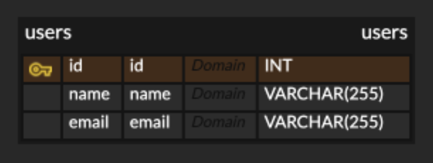

# Rust

- Rust의 warp 라이브러리를 사용해서 REST API를 구현했습니다.

- Rust를 처음 사용해보기 때문에 다른 언어로 구현을 할지 고민을 했으나 Rust로 만든 어플리케이션을 도커 컨테이너화 하는 것과 배포를 하는 것도 의의가 있을 것이라고 판단해 Rust를 사용하기로 결정했습니다.

- 데이터 모델은 간단하게 구성했습니다.

- 

- user_queries 파일에서 데이터베이스에 쿼리문을 보내는 함수를 정의하고 handlers 파일에서 그 함수를 호출합니다.

- main 파일에서 API URL에 handlers의 함수를 맵핑하여 웹서비스를 구성했습니다.

# Docker

- 쿠버네티스 클러스터에 배포하기 위해 Dockerfile을 작성해 도커 이미지를 빌드하고 도커 허브에 퍼블릭 이미지로 Push했습니다.

# 부족했던 부분

- Rust를 처음 사용해보는 상태에서 기능 구현을 우선으로 하다보니 예외처리나 코드의 가독성 등을 고려하지 못했던 점이 아쉬웠고 추후 Rust를 지속적으로 사용한다면 기초 공부부터 시간을 충분히 들여서 개선해야겠다고 생각했습니다.

- 로컬 환경에서는 실행이 잘 되고 Postman으로 기능 확인이 되었지만 Docker 컨테이너에서는 빌드한 바이너리 파일이 정상적으로 실행되지 않는 오류가 있었습니다. 우선은 실행 자체보다 구현과 배포에 중점을 두고 추후 해결해야 할 문제로 남겨두었습니다.